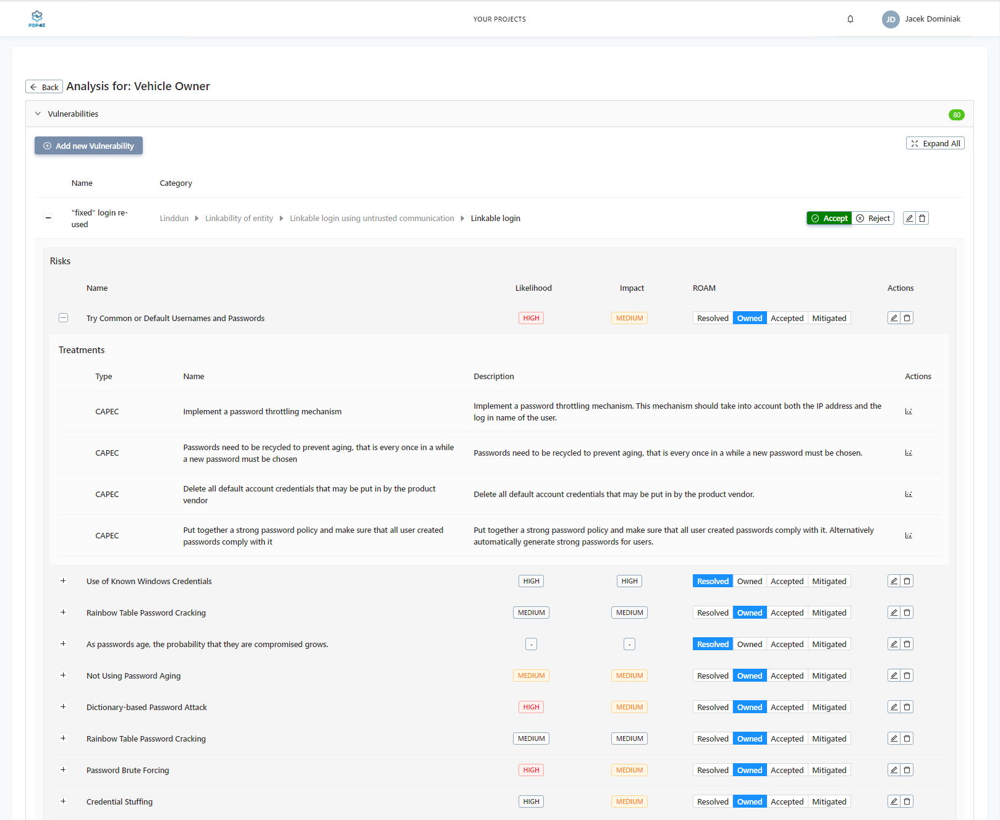

# Risk Management User Guide

The scope of this guide covers the use of the Risk Management tool to analyse the Data Flow Diagram of the application. The tool is also offered as a commerial offering with far superior capabilties. Please visit [beawre.com](https://beawre.com) for more informations.

## Project creation

The analysis of the risks against the assets can be organized with in a Project scope. This enables for multiple scenarios of and comparison of approaches to mitigation actions, different level of risks and data flows.

### To create a project:

- click on **Actions** menu

- select **New project**
- specify Project Name on the pop up field and click **OK**

### Manage projects

- to enter the project either double click on the project row or select **Open Assets** from the project actions menu

- to remove the project select the appropriate action from the actions menu of the project row you would like to modify

## Data Flow Diagram Definition

Once entered asset analysis page, specify the data flow diagram to be analysed. This can be done by:

1. Importing the model of the Data flow diagram by the action menu specified on the right side of the editor. . You can also export the project.
1. Drag and dropping appropriate elements of the data flow diagram in the editor to build the complete analysis scenario. _Please note that you can reuse elements from the other projects by unfolding the type of elements and dragging the element to the current editor. The reused elementes carry over the analysis from its respected project_

**Data flow elementes are being defined by creating a link between the DFD elements.**

Once all elements are defined, analysis can be performed.

## Vulnerabilitites, Risks and Treatments detection

Risk Management tool is capable of detecting Vulnerabilities, Risks and Treatments based on the built in database. Example of such database can be found in the `kb` folder of the open source repository.

In order to iniate the the automatic vulnerability detection, following steps have to be performed:

1. Select element for analysis in the editor OR choose element for analysis in the **List of Assets** tab.
   
1. Click on **DFD Questionaire** on the right side of the page
   
1. Fill in the questions and connections based on your knowledge. If you are unsure of the answer, you can leave it as **No asnwer**. In this case the detector will choose the answer based on the most common scenario given the DFD element, type and its connection to the other types.
1. Once filled, click **OK**. It will lauch detection which you can see in the **List of Assets** tab.

## Risks assessment

In order to perform risk assessment on the asset:

### Validate, explore and extend vulnerabilities

1. Select the asset in the editor or in the **List of Assets** tab.
1. Click on **Go To Analysis** button
1. You will be presented with the interactive list of vulnerabilities table.

   It is possible to explore the detected vulnerabilitites and in case of them being autodetected _accept_ or _reject_ them. In case of rejection, the reasoning needss to be added. It is also possible to explore trees of dependencies between the Vulnerabilities, Risks they expose the asset to and potencial mitigation actions. It can be achieved by unfolding each of the level in the vulnerability table.

   

   Within this step, it is also possible to ROAM the Risks connected to vulerabilities, meaning giving them the current status. In some cases, the system will select the appropriate ROAM status itself.

   ROAM stands for:

   - **Resolved** – the risk has been answered and avoided or eliminated.
   - **Owned** – the risk has been allocated to someone who has responsibility for doing something about it.
   - **Accepted** – the risk has been accepted and it has been agreed that nothing will be done about it.
   - **Mitigated** – action has been taken so the risk has been mitigated, either reducing the likelihood or reducing the impact.

1. Next, you can edit the predefined vulnerabilities to fit your system better by clicking **edit** icon on the right side of the table OR define new vulneraiblities undetected by the system by clicking **Add new Vulnerability** button on the top of the page.

### Define Risks and mitigation actions

Risks definition is the most time consuming part of the whole assessment. In order to do that:

1. Click on the **edit** icon (icon with the pencil) to enter risk edit mode.
   
   The edit mode is organize in 3/4 steps depending on how advanced the analysis is. The steps follow risk definition methodology defined by [CORAS](http://coras.sourceforge.net/), these are:

   1. Definition of unwanted incident with it's name, description and connection to previosly defined vulnerability
   1. Specification of Likelihood and Impact of the Risk. Risk Management tool uses [OWASP](https://owasp.org/). Extended privacy focused version of OWASP defined by PDP4E project is also available.
      
      In order to help assessing the impact, the tool provides integration with [GDPR Enforecement Tracker](https://www.enforcementtracker.com/) to showcase relevant fines issued against the company that failed to mitigate the risk in question.

   1. Next, specification of the mitigtation actions should take place. Risk Management tool can work with other tools to inject the migitation actions into typical DevOps life cycle. Integration with Jira and Git, emails, notifications and SQL databases and many other are avialble under our [Beawre](beawre.com) commerical license. Example of such integration, based on the mitigation action being pushed / pulled from JIRA, can be seen in the screenshot bellow:
      

      Autodetected mitigations actions can be discarded or approved at this steps. The tool is capable of monitoring evolution of the mitigation actions through the notion of evidence collectors, that use probes to collect data about the progression of the migitation action and give better understanding on the factual level or risks based on the evidences collected.

   1. Once mitigation actions, the last step is to define the level or **Residual Likehihood and Impact** values that represent the level or these dimensions _after_ successful application of the mitigation actions. This step is simailar to second step of the process and the residual values become the nominal values after they are defined.
   1. Adjust the status of ROAM in the main table.

The overall analysis status can be seen in the initial tree table.

## GDPR control

The Risk Management tool provides means to understand the impact of the risk assessment against the GDPR compliance. The main dashboard can be accessed on the project view under **GDPR Risk Control Dashboard** tab.

The dahsboard allows to understand the level of fulfillment of the dimensions of GDPR Pricipals and GDPR Subject Rights. Clicking on the charts allows to understand what risks are impacting the specified dimensions and what is their status.

## Support

Risk Management is being continiously developed by Beawre Digital S.L. Feel free to reach out to us under: [contact@beawre.com](mailto:contact@beawre.com) with any problems or inquiries you might have.
